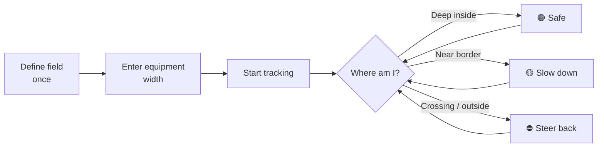

# BoundaryIQ Documentation

> **Stay inside your own field.** BoundaryIQ turns any smartphone into a
> precision boundary assistant for farmers - no hardware, no subscription, no
> account.

Welcome to the complete documentation set for **BoundaryIQ**. Whether you are a
farmer who wants to start using the app today, a business stakeholder evaluating
its value or an engineer extending the codebase - start here.

---

## Pick your path

| I am a... | Start here | Then read |
|---|---|---|
| 🚜 **Farmer / end user** | [Getting Started](user-guide/getting-started.md) | [User Manual](user-guide/user-manual.md) · [FAQ](user-guide/faq.md) · [Troubleshooting](user-guide/troubleshooting.md) |
| 💼 **Business stakeholder** | [Vision](overview/vision.md) | [Business Case](overview/business-case.md) · [Use Cases](overview/use-cases.md) · [How It Works](overview/how-it-works.md) |
| 🛠️ **Engineer / technical** | [Architecture](technical/architecture.md) | [Tech Stack](technical/tech-stack.md) · [Data Model](technical/data-model.md) · [ADRs](adr/README.md) |
| 🗺️ **GIS / data integrator** | [Cadastre Integration](technical/cadastre-integration.md) | [Security & Privacy](technical/security-privacy.md) |

---

## What is BoundaryIQ?

BoundaryIQ is a free, open-source web app that
helps a farmer **work right up to the edge of their own land without crossing
into a neighbour's field.** You define your field boundary once and enter your
equipment/implement width; the app then uses the phone's GPS to track your
position and raises an escalating visual, audio haptic alarm as the
implement approaches - or crosses - the border.



## Documentation map

```
docs/
├── README.md                     ← you are here
├── overview/                     business & non-technical
│   ├── vision.md                 the problem, the mission, the future
│   ├── business-case.md          value, market, cost, impact
│   ├── use-cases.md              scenarios by audience (farm & beyond)
│   └── how-it-works.md           plain-language explanation
├── user-guide/                   for the people in the equipment
│   ├── getting-started.md        5-minute quick start
│   ├── user-manual.md            every feature explained
│   ├── faq.md                    common questions
│   └── troubleshooting.md        when something goes wrong
├── technical/                    for engineers & integrators
│   ├── architecture.md           system design & data flow
│   ├── tech-stack.md             libraries and why
│   ├── data-model.md             state shape & persistence
│   ├── deployment.md             how to host & ship
│   ├── security-privacy.md       data handling & threat model
│   ├── cadastre-integration.md   official Serbian / WMS data
│   ├── contributing.md           dev setup & conventions
│   └── glossary.md               terms & units
└── adr/                          architecture decision records
    ├── README.md                 index + how we record decisions
    └── 0001...0010-*.md            individual decisions
```

## Core principles

1. **Free forever.** Open-source stack, no licensing costs, no SaaS fees.
2. **Works without an account.** No sign-up, no server, no data leaves the device.
3. **Works in a real field.** Mobile-first, offline-capable, glove-friendly, sunlight-readable.
4. **Honest about limits.** It is a guidance aid, not a survey-grade legal instrument.

## Project facts at a glance

| | |
|---|---|
| **Name** | BoundaryIQ |
| **Type** | Progressive Web App (PWA) |
| **Stack** | Leaflet · Turf.js · vanilla JS · OpenStreetMap/Esri tiles |
| **License posture** | 100% open-source dependencies (BSD-2 / MIT) |
| **Backend** | None - fully client-side |
| **Data storage** | Browser `localStorage` on the device |
| **Official data** | GeoSrbija / RGZ INSPIRE Cadastral Parcels WMS |
| **Cost to operate** | €0 (static hosting free tiers) |

---

*See the root [`README.md`](../README.md) for a quick technical overview and run
instructions.*
