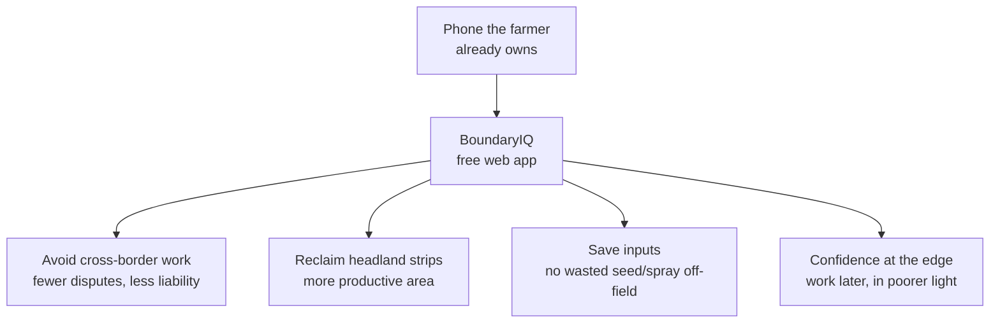

# Business Case

A concise, evidence-minded summary for decision-makers, funders, cooperatives
and public-sector partners.

## Executive summary

BoundaryIQ is a **zero-cost, zero-infrastructure** smartphone tool that prevents
farmers from accidentally working a neighbour's land and from leaving their own
land unworked. It delivers the *core safety benefit* of expensive precision
guidance systems to anyone with a phone, at **€0 cost per user** and **€0 cost
to operate**.

## The opportunity

| Factor | Reality on the ground |
|---|---|
| **Fragmented parcels** | The average holding in the region is split into many small, irregular plots with shared, unmarked borders. |
| **Boundary disputes** | Accidental cross-tilling and spraying are a recurring source of neighbour conflict and occasional litigation. |
| **Input waste** | Seed, fertiliser chemicals applied past your border are pure loss and a liability. |
| **Lost yield** | Over-cautious headlands leave a productive strip idle along every edge, every season. |
| **Precision divide** | RTK auto-steer (typically thousands of euros) is out of reach for most smallholders. |

BoundaryIQ targets exactly the gap between "expensive precision hardware" and
"nothing at all."

## Value proposition

### Quantifying the upside (illustrative)

The exact numbers depend on the farm, but the *mechanism* of value is concrete
and easy to model per user:

- **Reclaimed area:** Driving safely 1 m closer along the edges of a field adds
  productive area proportional to the perimeter. On many small, long plots this
  is a meaningful fraction of a hectare across a holding.
- **Input savings:** Eliminating off-field application removes both the cost of
  the wasted input and the risk of compensation claims.
- **Dispute avoidance:** Even a single avoided boundary dispute can outweigh the
  (zero) cost of the tool many times over.

> We deliberately avoid inflated headline figures. The honest pitch is: *the
> tool is free, the downside is nil the upside is real and compounding.*

## Cost model

| Line item | BoundaryIQ | Typical RTK auto-steer |
|---|---|---|
| Hardware | €0 (uses existing phone) | €€€€ (receiver + steering) |
| Software license | €0 (open source) | recurring / correction subscriptions |
| Per-user cost | €0 | high |
| Hosting / operations | €0 (static free tier) | n/a |
| Onboarding | Self-service, minutes | Dealer install |

BoundaryIQ is not a *replacement* for RTK precision farming; it is the
**accessible entry point** that protects the 90% who will never buy it.

## Who benefits

- **Smallholder & family farms** - the primary users.
- **Agricultural cooperatives & advisory services** - distribute one link to all
  members; nothing to license or maintain.
- **Public bodies (e.g. RGZ / agricultural ministries)** - a citizen-facing
  application of open cadastral data that demonstrates the value of national
  spatial-data infrastructure.
- **NGOs & development programmes** - a no-cost digital tool that improves rural
  livelihoods and land-use efficiency.

## Why it is sustainable

- **No servers to pay for.** The app is fully client-side and can be hosted on
  free static tiers indefinitely.
- **No vendor lock-in.** Built entirely on permissively licensed open-source
  software and open public data.
- **Low maintenance surface.** No accounts, no database, no backend means a tiny
  attack surface and minimal operational burden.

## Risks and honest limitations

| Risk | Mitigation |
|---|---|
| Consumer GPS accuracy (~3-10 m) | Configurable safety margin; clear in-app guidance; roadmap for optional high-accuracy GNSS. |
| Users mistaking it for legal boundaries | Explicit disclaimers; cadastre shown as a *tracing aid*, not authority. |
| Cadastre service availability/terms | Overlay is optional and source-configurable; core function works with user-drawn fields alone. |
| Connectivity in remote fields | Offline PWA caches the app; only first-time tiles need a network. |

## The ask

BoundaryIQ already works end-to-end at zero cost. The most valuable support is
**distribution** (getting the link to farmers through cooperatives and advisory
networks) and **endorsement** of the open-data approach by public partners.

---

*Next: [Use Cases →](use-cases.md) · [How It Works →](how-it-works.md) · [Vision →](vision.md)*
