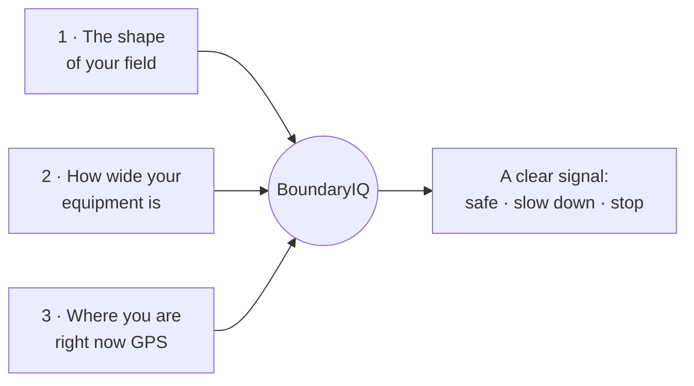
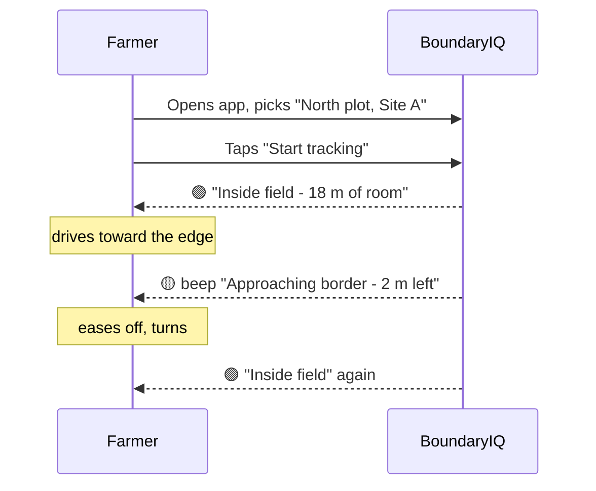

# How It Works (in plain language)

No jargon. This page explains what BoundaryIQ does and how, for anyone - no
technical background needed.

## The idea in one sentence

> You tell the app the shape of your field and how wide your equipment is; the app
> watches your GPS location and shouts before your equipment reaches the edge.

## The three things the app needs

### 1. The shape of your field

You draw your field's outline once. There are three easy ways:

- **Tap the corners on a satellite map** - like tracing a photo.
- **Drive around the edge** and let the phone record each corner.
- **Type in coordinates** if you already have them on paper or from the cadastre.

The app remembers it. You only do this once per field.

### 2. How wide your equipment is

A plough, sprayer or seeder sticks out to the sides. If the centre of your
equipment is 1.5 m from the border and your implement is 3 m wide, the *edge* of
the implement is already **on the line**. So the app asks for your working width
and quietly does the maths: it keeps half the width (plus a little safety
margin) clear of the border.

It even draws a **yellow "safe zone"** just inside your field - stay within the
yellow line and your implement never crosses over.

### 3. Where you are right now

Your phone has a GPS chip, the same one that powers map navigation. BoundaryIQ
reads your live position and compares it to your field outline many times a
minute.

## What you see and hear while driving

A big colour-coded banner sits at the top of the screen, readable at a glance:

| Colour | Meaning | What the app does |
|---|---|---|
| 🟢 **Green** | Comfortably inside your field | Shows how much room you have left |
| 🟡 **Yellow** | Getting close to the border | Beeps gently, light vibration - *slow down* |
| ⛔ **Red** | Implement crossing the line or you've left the field | Loud repeating alarm + strong vibration - *steer back* |

So even if the phone is on a mount across the cab and you can't read the small
print, the **colour and the sound** tell you everything.

## A typical day

## Common-sense reassurances

- **No internet? Mostly fine.** Once the app has loaded, it keeps working
  offline. Only brand-new map areas need a connection to download the imagery.
- **No account, ever.** You never sign up. Nothing about you or your land is sent
  anywhere - it all stays on your phone.
- **Your data is yours.** You can back it up to a file and move it to another
  phone whenever you like.

## What it is *not*

BoundaryIQ is a **helpful guide**, like a reversing sensor on a car - not a legal
document. Phone GPS can be off by a few metres, so for anything official (selling
land, settling a dispute) you still rely on the cadastre and a surveyor. That's
exactly why the app lets you add a **safety margin** and shows the official
cadastre map as a guide.

---

*Next: [Getting Started for farmers →](../user-guide/getting-started.md)*
