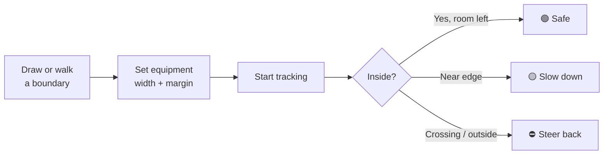

# Use Cases

> **One app, one pattern:** draw a boundary, set how wide your equipment is,
> drive with GPS - get warned before you cross the line.

This page lists scenarios where BoundaryIQ works **today, as shipped** - no
customisation, no reimplementation, no configuration beyond what the app already
offers. The interface uses farm-oriented labels (*Field*, *Equipment*), but the
underlying behaviour is generic: **a named polygon + a working width + live
position alerts.**

**How to read the tables**

| Column | Meaning |
|---|---|
| **Setup** | What you enter in the app (same tabs for every use case). |
| **"Field"** | Your allowed work zone - any polygon, any name. |
| **"Equipment" width** | The full side-to-side reach of whatever extends beyond your vehicle centre (blade, boom, deck, bucket edge). |

> **Reminder:** Phone GPS is typically accurate to 3–10 m. Use the safety
> margin. This is a guidance aid, not a legal or survey instrument - see
> [FAQ](../user-guide/faq.md).

---

## Farmers

The primary audience. Every row uses the app exactly as documented in the
[User Manual](../user-guide/user-manual.md).

| Use case | Why it fits | Setup |
|---|---|---|
| **Ploughing / cultivating near borders** | Prevents tillage crossing into a neighbour's plot | Trace field → set plough width → track |
| **Spraying / fertilising at edges** | Stops seed and chemicals landing off your land | Trace field → set boom width → track |
| **Seeding / drilling headlands** | Over-seeding a neighbour's strip is pure loss | Trace field → set seeder width → track |
| **Mowing pasture or meadow edges** | Cutter extends beyond the vehicle centre | Trace field → set mower deck width → track |
| **Orchards / vineyards / specialty crops** | Narrow plots, shared boundaries, costly inputs | Satellite + optional cadastre overlay → trace → track |
| **Organic / certified plot compliance** | Must stay inside a certified area | Trace your cert boundary (or a smaller inner polygon) → track |
| **Rented or leased land** | Stay inside the parcel you pay for | Trace from cadastre overlay or walk the border → track |
| **New operator / headland training** | Learn where edges are without RTK hardware | Draw field → enable sound/vibration → drive slowly or use **Test mode** |
| **Pre-season parcel inventory** | Document boundaries and area before work starts | Walk the border or draw on satellite; read area/perimeter stats - tracking optional |
| **Multi-plot holdings** | Many small, irregular parcels on one farm | One saved "field" per plot; switch from the dropdown |

---

## Conequipments

Service providers who work on **different sites and clients**. The app needs no
account: create a zone per job, export when done, import on another device.

| Use case | Industry | Setup |
|---|---|---|
| **Custom field operations** | Agriculture | One saved field per client job; set implement width for that machine |
| **Landscaping / grounds maintenance** | Horticulture | Draw client property boundary → set mower or spreader width → track |
| **Site earthworks** | Construction | Draw permitted site polygon → set bucket/blade reach → track during cut/fill |
| **Land clearing before build** | Construction / development | Trace lot boundary from satellite → set clearing equipment width → track |
| **Solar / wind site preparation** | Energy | Draw lease/work polygon → track machinery within it |
| **Forestry extraction within a parcel** | Forestry | Walk or trace forest plot → set skidder/forwarder width → track trails |
| **Snow plowing on private estates** | Winter services | Draw driveways/estate zone → set plow blade width → track |
| **Municipal subcontract - parks & verges** | Public greenspace | Draw assigned maintenance zone → set equipment width → track |
| **Cemetery / memorial grounds** | Facilities | Trace section boundary → set mower width → track |
| **Golf course / sports-ground sections** | Recreation | One polygon per fairway or pitch section → track while mowing |
| **Marina / harbour yard work** | Marine | Draw permitted yard polygon → set vehicle/equipment width → track |
| **Film / event site vehicle limits** | Media & events | Draw permitted equipment zone on location → track trucks/generators |
| **Demolition site boundary** | Construction | Trace site limit → track excavator within polygon |
| **Pipeline / utility corridor work** | Infrastructure | Draw authorised work corridor as polygon → track along it |

**Conequipment workflow tip:** Name each saved field after the client and date
(e.g. `Petrović - Lot 12 - 2026`). Use **Export all data** at job end for your
records; **Reset** before the next client if the device is shared.

---

## Cooperatives and advisory services

Groups that **distribute tools, train members or support many smallholders**
without operating infrastructure.

| Use case | Value for the cooperative | How to use the app as-is |
|---|---|---|
| **Member onboarding link** | Zero cost per member; no accounts to manage | Host once on free HTTPS; share one URL |
| **Seasonal boundary clinic** | Help members trace parcels before spring work | Workshop: satellite + cadastre overlay + **Walk the border** |
| **Spray-team safety briefing** | Standardise how close operators may work to edges | Demonstrate width + margin math on the **Equipment** tab |
| **Young-farmer / new-holder training** | Build confidence at the edge without expensive hardware | **Test mode** in the classroom; live demo in a car at low speed |
| **Dispute-prevention programme** | Reduce accidental cross-border work | Teach members to trace from cadastre and add a generous safety margin |
| **Custom-operator coordination** | Members hire the same conequipment; share boundary files | Export JSON from one phone → conequipment imports on theirs |
| **Holding inventory across members** | Rough area totals for planning | Each member saves their plots; cooperative collects exported files |
| **Offline field days** | Works without signal after first load | Pre-load satellite tiles over the village while on Wi-Fi |
| **Non-farm cooperative services** | Landscaping, snow or municipal co-ops reuse the same link | Same app; members draw their assigned zones |

Cooperatives add value through **distribution and training**, not licensing -
consistent with the [business case](business-case.md).

---

## Public sector

Government bodies, cadastre offices, municipalities NGOs that promote
**open spatial data** and practical citizen tools.

| Use case | Audience | How the app supports it |
|---|---|---|
| **Citizen cadastre literacy** | Landowners | GeoSrbija WMS overlay + trace exercise; see [Cadastre Integration](../technical/cadastre-integration.md) |
| **Demonstrating open-data value** | Policy / RGZ partners | Free citizen-facing use of INSPIRE cadastral parcels |
| **Municipal parks maintenance** | Greenspace crews | Draw park section polygon → set mower width → track (no cadastre needed) |
| **School / campus grounds** | Facility teams | One polygon per zone; switch between quadrants |
| **Conservation area vehicle access** | Rangers | Draw managed-zone boundary → track maintenance vehicles inside it |
| **Archaeological dig permit zone** | Cultural heritage teams | Trace permitted excavation polygon → track machinery within it |
| **Temporary disaster-relief work yards** | Emergency logistics | Quick polygon around staging area → track supply vehicles |
| **Rural development programmes** | NGOs | Zero-cost digital tool; no backend; privacy by design |
| **Agricultural extension demos** | Advisory officers | Test mode + cadastre overlay for indoor presentations |
| **Airfield / private strip grass maintenance** | Aviation (private) | Trace strip boundary → set mower width → track |

Public-sector partners benefit from **endorsement and distribution** - the app
already runs at zero operating cost ([deployment](../technical/deployment.md)).

---

## Beyond agriculture - diverse scenarios

These use cases are **deliberately non-farm**. They use the same three steps -
boundary, width, track - with no changes to the application.

| Use case | Sector | What you draw | What width means |
|---|---|---|---|
| **Construction site limits** | Building | Permitted work polygon on satellite | Excavator bucket or dozer blade reach |
| **Real-estate lot clearing** | Property development | Lot outline | Clearing attachment width |
| **Snow removal routes** | Winter services | Driveways, parking lots, estate paths | Plow blade width |
| **Cemetery grounds mowing** | Facilities | Section boundary | Mower deck |
| **Golf fairway mowing** | Recreation | Fairway polygon | Gang mower width |
| **School playing-field maintenance** | Education | Pitch boundary | Mower width |
| **Film-set equipment zone** | Media | Permitted vehicle area on location | Widest truck or generator footprint |
| **Festival / event loading yard** | Events | Temporary yard polygon | Truck width |
| **Marina hardstanding work** | Marine | Yard limit | Service vehicle width |
| **Archaeological excavation limit** | Heritage | Dig permit boundary | Machine within site |
| **Conservation reserve patrol roads** | Environment | Managed zone | Ranger vehicle width |
| **Private airstrip grass cutting** | Aviation | Strip outline | Mower width |
| **Quarry / extraction boundary** | Mining (informal) | Extraction limit polygon | Loader or truck width |
| **Warehouse yard operations** | Logistics | Yard polygon | Widest forklift/load reach |
| **ATV / utility vehicle on private land** | Property owners | Property boundary | Vehicle width |
| **Disaster-relief staging area** | Humanitarian | Temporary camp/depot zone | Supply truck width |

The pattern is always the same: **if you can draw the allowed zone and measure
how far your equipment sticks out sideways, the app works.**

---

## Use cases that need only mapping (no live tracking)

Several features stand alone - no **Start tracking** required.

| Use case | Features used |
|---|---|
| **Rough area & perimeter check** | Draw or walk border → read stats on the Field tab |
| **"Where is my parcel?"** | Cadastre overlay + trace outline on satellite |
| **Document a boundary for your records** | Walk border → **Copy current** coordinates or **Export** JSON |
| **Desk demo / classroom training** | **Test mode** + tap the map to simulate positions |
| **Multi-site inventory** | Save many named polygons; export a backup file |

---

## What the app is not (any audience)

These need a **different product** - not a settings tweak:

| Need | Why BoundaryIQ is not the fit |
|---|---|
| Row-by-row planting guidance | No path or row logic |
| Centimetre / RTK precision | Consumer GPS only (~3–10 m) |
| Legal boundary certification | Guidance aid, not a survey |
| Automatic coverage / pass mapping | Not implemented (see [vision roadmap](vision.md)) |
| "Stay X metres away from a line" without drawing it | You must draw the allowed polygon yourself |
| Long-range on-foot tracking without a vehicle context | Optimised for equipment with a measurable width |

---

## Quick reference by audience

| Audience | Best starting use cases |
|---|---|
| **Farmer** | Ploughing/spraying at edges, headland training, multi-plot inventory |
| **Conequipment** | Per-client polygons, landscaping, construction sites, snow routes |
| **Cooperative** | Distribution link, boundary clinics, export/import between members |
| **Public sector** | Cadastre literacy, park maintenance, open-data demonstration |

---

*See also: [How It Works](how-it-works.md) · [Business Case](business-case.md) · [Getting Started](../user-guide/getting-started.md)*
