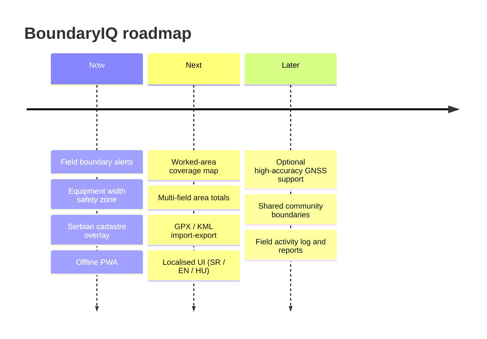

# Vision

> *Every metre of land matters. Every farmer deserves precision - not just the
> ones who can afford a €30,000 guidance system.*

## The problem, told plainly

Across Serbia and the wider region, fields are small, irregular pressed up
against one another. Boundaries are often invisible on the ground - no fence, no
furrow, just an imaginary line agreed generations ago and recorded in a cadastre
office. When a farmer ploughs, sprays or harvests near the edge, they face a
quiet, recurring dilemma:

- **Go too far** and you till, seed or spray your neighbour's land - wasting
  inputs, triggering disputes and sometimes ending up in court.
- **Stay too cautious** and you leave a strip of your *own* land unworked, year
  after year - lost yield that compounds across every season and every edge.

A modern equipment with RTK auto-steer solves this beautifully. But that
technology costs more than many smallholders earn in a year. The result is a
**precision divide**: the tools that protect land and livelihood are locked
behind a price most family farms cannot justify.

## Our mission

**Put field-boundary precision in the pocket of every farmer - for free.**

BoundaryIQ uses the one piece of precision hardware almost every farmer already
owns: the GPS in their smartphone. It will never match RTK centimetre accuracy,
and it does not try to. Instead it does something deceptively powerful: it knows
*where your field ends*, it knows *how wide your implement is* it warns you
**before** the implement crosses the line - in time to steer back.

No purchase. No installation. No subscription. No account. Open the page, draw
your field drive.

## What we believe

- **Precision is a right, not a luxury.** The math behind "am I inside my field?"
  is simple geometry. It should be free.
- **Software should respect the farmer.** No data harvesting, no ads, no lock-in.
  The field boundary you drew belongs to you and stays on your phone.
- **The best tool is the one you already have.** A phone, a browser and a clear
  sky are enough.
- **Honesty builds trust.** We are explicit about GPS limits and never pretend to
  replace a surveyor or the official cadastre.

## The future we are building toward

Today BoundaryIQ is a single, focused tool: *don't cross the border*. The
foundation we have laid - open data, open source, device-local state - opens a
roadmap that stays true to the mission:

Every step will keep the promises that define us: **free, private, open
genuinely useful in a muddy field at 6 a.m.**

---

*Next: [Business Case →](business-case.md) · [Use Cases →](use-cases.md) · [How It Works →](how-it-works.md)*
