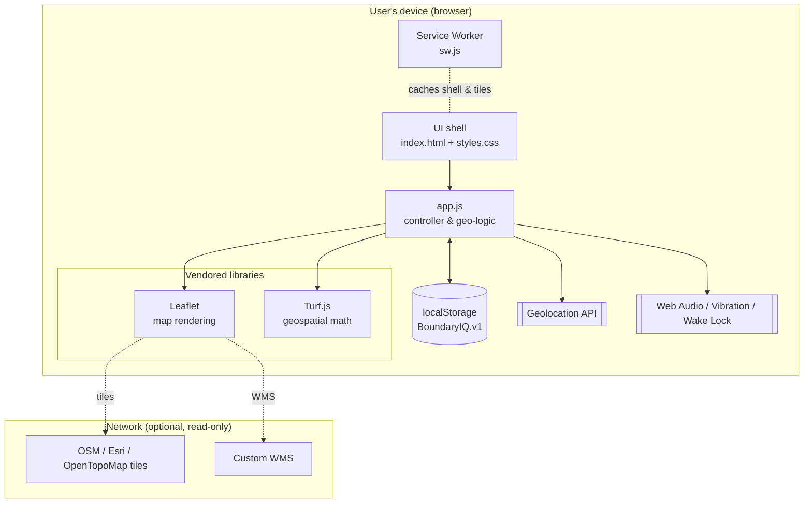
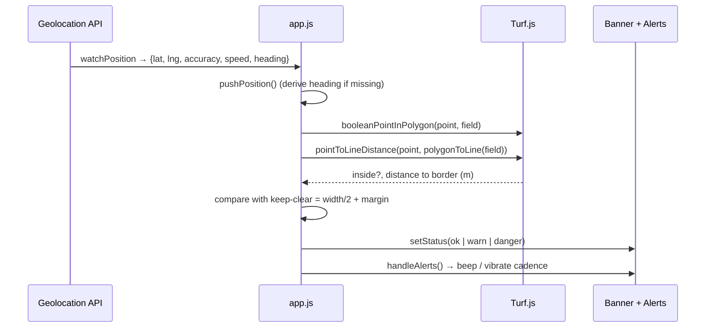
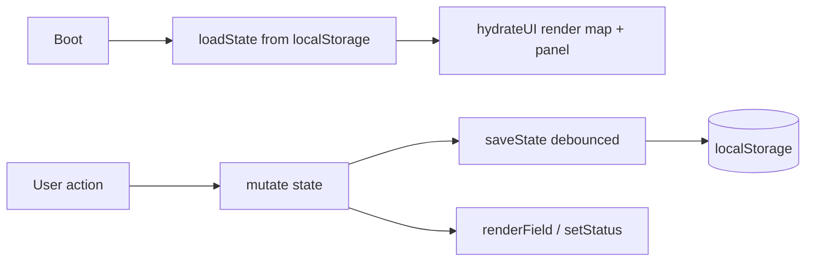

# Architecture

BoundaryIQ is a **client-only Progressive Web App**. There is no backend, no
database no build step. All logic runs in the browser; all state lives on
the device. This page describes the system design and the runtime data flow.

> For the *reasons* behind these choices, see the [ADRs](../adr/README.md).

## High-level view

Everything inside *Device* works offline after first load. The *Network* box is
optional and used only to fetch map imagery and the (optional) cadastre overlay.

## Components

| Component | File | Responsibility |
|---|---|---|
| **UI shell** | `index.html`, `styles.css` | Layout, tabs, controls, status banner. Mobile-first, no framework. |
| **Controller** | `app.js` | Single module that owns state, wires events, manages the map, runs the geo-evaluation loop drives alerts. |
| **Map** | Leaflet (`vendor/leaflet.js`) | Renders base tiles, the field polygon, the safe zone, vertices, the equipment marker the WMS overlay. |
| **Geo-math** | Turf.js (`vendor/turf.min.js`) | Point-in-polygon, point-to-line distance, polygon area/length, inward buffering. |
| **Persistence** | `localStorage` | Serialises the whole app state under one key. |
| **PWA shell** | `manifest.webmanifest`, `sw.js`, `icon.svg` | Installability and offline caching. |

`app.js` is intentionally organised into clear sections: *State*, *Helpers*,
*Map setup*, *Field layers*, *Field selection*, *Drawing/Walk/Coordinates*,
*Equipment calc*, *Tracking*, *Alerts*, *Geo math*, *Import/Export*, *UI wiring*,
*Boot*.

## The tracking loop (core algorithm)

This is the heart of the app - evaluating where you are relative to the border
on every position update.

### Decision logic

Let `d` = distance from the GPS point to the nearest field edge, `halfW` =
width ÷ 2, `clear` = halfW + margin.

| Condition | State | Meaning |
|---|---|---|
| point **not** inside polygon | ⛔ danger | Outside your field |
| inside **and** `d ≤ halfW` | ⛔ danger | Implement edge over the border |
| inside **and** `d ≤ clear` | 🟡 warn | Within keep-clear distance |
| otherwise | 🟢 ok | Safe working room |

The **implement-edge clearance** (`d − halfW`) is what the banner emphasises:
how much room the *edge of the equipment* has before it crosses.

## Coordinate handling

- **Storage & UI** use `[lat, lng]` (Leaflet's order).
- **Turf.js / GeoJSON** use `[lng, lat]`. Conversion happens in `fieldToTurf()`
  and `turfToLeaflet()`, which are the single crossing points between the two
  conventions. All distances/areas are computed in **metres** via Turf options.

## State management

A single in-memory `state` object is the source of truth. It is hydrated from
`localStorage` on boot and written back (debounced) on every change via
`saveState()`. The UI is re-rendered from state by `hydrateUI()` and
`renderField()`. See [Data Model](data-model.md) for the exact shape.

## Offline strategy

The service worker (`sw.js`) precaches the **app shell** (HTML, CSS, JS, vendored
libs, icons) with a cache-first strategy for same-origin requests a
network-first-with-cache-fallback strategy for cross-origin map tiles. This means
the app launches offline previously seen tiles remain available. See
[ADR-0006](../adr/0006-pwa-offline-support.md).

## Why no backend?

A boundary check is pure local geometry. Removing the server eliminates hosting
cost, accounts, privacy risk an entire class of failures - at the price of
no cross-device sync (handled instead by manual Export/Import). See
[ADR-0002](../adr/0002-zero-build-static-spa.md) and
[ADR-0005](../adr/0005-localstorage-no-auth.md).

---

*Next: [Tech Stack →](tech-stack.md) · [Data Model →](data-model.md) · [ADRs →](../adr/README.md)*
