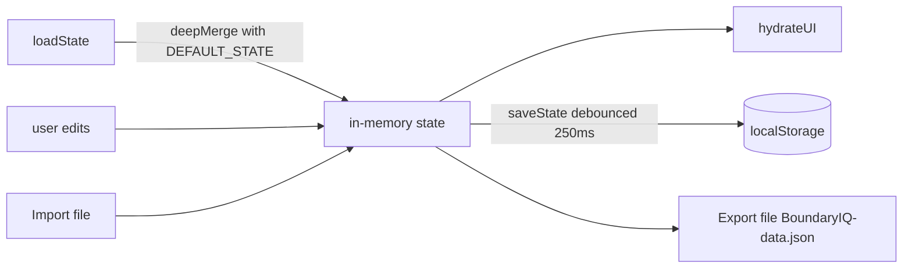

# Data Model

All application state is a single JSON-serialisable object, persisted under one
`localStorage` key. There is no server schema and no database.

## Storage key

```
localStorage["BoundaryIQ.v1"] = JSON.stringify(state)
```

The `.v1` suffix versions the shape so future migrations can detect and upgrade
older data.

## State shape

```jsonc
{
  "fields": [
    {
      "id": "a1b2c3d",                 // short random id
      "name": "North plot, Site A",           // user-given label
      "coords": [                      // ordered ring, WGS84 [lat, lng]
        [44.81250, 20.46150],
        [44.81280, 20.46260],
        [44.81190, 20.46300]
        // 3+ points required to form a polygon
      ]
    }
  ],
  "activeFieldId": "a1b2c3d",          // currently selected field (or null)

  "equipment": {
    "width": 3,                        // implement/working width in metres
    "margin": 0.5,                     // extra safety margin in metres
    "showInner": true                  // draw the yellow safe zone?
  },

  "layers": {
    "base": "sat",                     // "osm" | "sat" | "topo"
    "cadEnabled": false,               // cadastre WMS overlay on/off
    "cadPreset": "geosrbija",          // "geosrbija" | "custom"
    "cadUrl": "https://inspire.geosrbija.rs/wms/cp",
    "cadLayer": "CP.CadastralParcel",
    "cadOpacity": 0.7                  // 0.1–1.0
  },

  "alerts": {
    "sound": true,
    "vibrate": true,
    "keepAwake": false
  }
}
```

## Field reference

| Field | Type | Notes |
|---|---|---|
| `fields[]` | array | Any number of named fields. |
| `fields[].id` | string | Random, stable identifier. |
| `fields[].name` | string | Display name; editable. |
| `fields[].coords` | `[lat, lng][]` | Ordered boundary ring; **3+** points to be a valid polygon. Not explicitly closed in storage - closure is added when converting to Turf. |
| `activeFieldId` | string \| null | Which field is shown/tracked. |
| `equipment.width` | number (m) | Full working width. |
| `equipment.margin` | number (m) | Added to half-width for the keep-clear distance. |
| `equipment.showInner` | boolean | Toggle the safe-zone polygon. |
| `layers.base` | enum | Active base map. |
| `layers.cad*` | mixed | Cadastre overlay configuration. |
| `alerts.*` | boolean | Alert channel preferences. |

## Coordinate conventions

| Context | Order | Example |
|---|---|---|
| Stored `coords`, Leaflet | `[lat, lng]` | `[44.8125, 20.4612]` |
| Turf.js / GeoJSON | `[lng, lat]` | `[20.4612, 44.8125]` |

Conversion is centralised in `fieldToTurf()` (storage → Turf) and
`turfToLeaflet()` (Turf → Leaflet), so the rest of the code never juggles order.

## Derived values (not stored)

These are computed on demand and never persisted:

| Value | Formula / source |
|---|---|
| Half implement width | `width / 2` |
| Keep-clear distance | `width / 2 + margin` |
| Safe zone polygon | `turf.buffer(field, -keepClear, { units: 'meters' })` |
| Distance to border | `min(pointToLineDistance(point, edge))` over polygon edges |
| Inside field? | `booleanPointInPolygon(point, field)` |
| Area / perimeter | `turf.area` / `turf.length` |

## Lifecycle



- **`loadState`** merges stored data over `DEFAULT_STATE`, so missing keys from
  older versions are backfilled (forward-compatible).
- **`saveState`** is debounced (~250 ms) to avoid thrashing storage during rapid
  edits (e.g. dragging/drawing).
- **Export/Import** serialise/deserialise this exact object as a JSON file for
  backup and device migration.

## Migration strategy

To evolve the schema:

1. Bump the key to `BoundaryIQ.v2`.
2. On load, detect a `v1` key, transform it, write `v2` remove `v1`.
3. Keep `deepMerge(DEFAULT_STATE, ...)` so additive changes need no migration at
   all.

---

*Next: [Security & Privacy →](security-privacy.md) · [Architecture →](architecture.md)*
