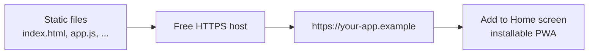

# Deployment & Hosting

BoundaryIQ is a set of static files. "Deploying" means **putting the folder
somewhere a browser can load it.** There is nothing to compile and no server
process to run.

## Critical requirement: a secure context

The Geolocation API (and Service Worker) require a **secure context**:

| Context | GPS works? | Service worker? |
|---|---|---|
| `https://...` | ✅ | ✅ |
| `http://localhost` | ✅ | ✅ |
| `file://...` (open file directly) | ✅ (Chrome/Firefox) | ❌ |
| plain `http://` on a remote server | ❌ | ❌ |

**For real field use on a phone, host over HTTPS.** All recommended hosts below
provide free HTTPS automatically.

## Option A - Open directly (fastest, desktop)

Double-click `index.html`. Good for trying the app and for **test mode**. The
service worker won't register over `file://`, so there's no offline caching, but
GPS works in Chrome/Firefox.

## Option B - Local server (development)

Any static file server works:

```bash
# Node
npx serve .

# Python 3
python -m http.server 8080

# PHP
php -S localhost:8080

# VS Code: "Live Server" extension → Open with Live Server
```

Then visit `http://localhost:8080`.

## Option C - Free HTTPS static hosting (recommended for production)

All of these have a free tier with automatic HTTPS and are a perfect fit:

| Host | How to deploy |
|---|---|
| **Netlify Drop** | Drag-and-drop the project folder onto [app.netlify.com/drop](https://app.netlify.com/drop). |
| **GitHub Pages** | Push the repo, enable Pages on the default branch / root. |
| **Cloudflare Pages** | Connect the repo or upload the folder; framework preset = *None*. |
| **Vercel** | Import the repo; framework preset = *Other* (static). |
| **Surge** | `npx surge .` |

No build command is needed. **Output/publish directory = the project root.**



## Files that must ship together

```
index.html
styles.css
app.js
manifest.webmanifest
sw.js
icon.svg
vendor/
  leaflet.js
  leaflet.css
  turf.min.js
  images/   (marker & layer icons)
```

Keep the **relative paths intact** - the service worker precaches these exact
paths. If you host under a sub-path (e.g. `example.com/BoundaryIQ/`), the
relative paths and `scope: "./"` in the manifest already handle it.

## Updating a deployed app

The service worker uses a versioned cache (`BoundaryIQ-v1` in `sw.js`). When you
change the app:

1. Bump the cache name (e.g. `BoundaryIQ-v2`) in `sw.js`.
2. Redeploy. On next visit the old cache is purged and the new shell is cached.

## Hardening (optional)

For a public deployment you may add HTTP headers via your host's config:

- `Content-Security-Policy` allowing `self`, the tile hosts the WMS host.
- `Referrer-Policy: no-referrer`.
- `Permissions-Policy: geolocation=(self)`.

These are optional; the app functions without them.

## Cost

**€0.** Every recommended host offers a free tier more than sufficient for a
static PWA there is no backend to pay for.

---

*Next: [Security & Privacy →](security-privacy.md) · [Contributing →](contributing.md)*
