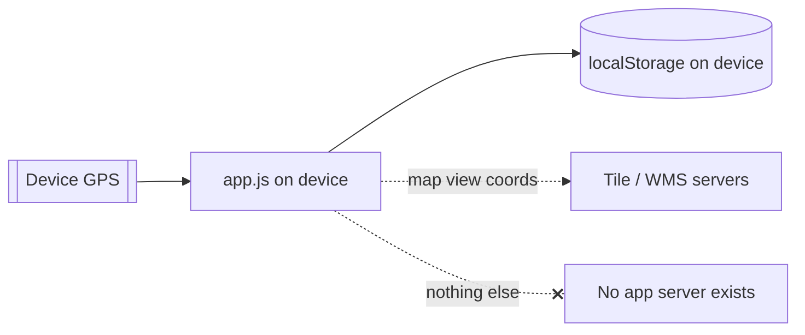

# Security & Privacy

BoundaryIQ is designed so that **privacy is the default, not a setting.** The
architecture removes most risk by removing the server entirely.

## Privacy at a glance

| Question | Answer |
|---|---|
| Is there a user account? | **No.** No sign-up, no login, no identifiers. |
| Is my location sent anywhere? | **No.** It is used on-device only. |
| Is my field boundary uploaded? | **No.** It lives in `localStorage` on your device. |
| Are there analytics, trackers or ads? | **No.** None. |
| What leaves the device? | Only requests for **map tiles** and (if enabled) the **cadastre overlay**. |
| Who can see my data? | Only someone with access to your unlocked device/browser. |

## Data flows

The only outbound network traffic is to **map/imagery tile servers** and the
optional **cadastre WMS**. These receive the standard information any web map
request carries (the map area being viewed, your IP address as with any web
request). They do **not** receive your stored field data they are only
contacted for areas you actually view.

> If even tile-server contact is a concern (e.g. an air-gapped scenario), the app
> still functions with previously cached tiles offline.

## What is stored where

- **Location:** `localStorage` (and the in-memory `state`) on the user's device.
- **Contents:** field boundaries, names, equipment settings, layer/alert
  preferences - see [Data Model](data-model.md).
- **Never stored:** raw GPS history/tracks are not persisted; only the current
  live position is held in memory while tracking.

## Threat model

| Threat | Exposure | Mitigation |
|---|---|---|
| Server breach leaking user data | **None** - there is no server or central store. | Architecture (no backend). |
| Account takeover / credential theft | **None** - there are no accounts. | No auth by design. |
| Network interception of field data | **None** - field data is never transmitted. | Device-local storage. |
| Tile/WMS provider sees viewed areas | Low - same as any web map. | Optional; cached offline; no PII attached. |
| Shared/lost device | Data readable by whoever unlocks the device. | OS device lock; Export then **Reset** before handing a device on. |
| Malicious WMS URL (custom source) | Loads third-party tiles only. | URL is user-entered and trusted; no script execution from tiles. |
| Supply-chain (dependencies) | Libraries are **vendored & pinned**, not pulled from a live CDN. | Reproducible, auditable `vendor/` folder. |

## Permissions requested

| Permission | Why | Optional? |
|---|---|---|
| **Location** | Core tracking. | Required for live tracking; not needed for drawing/test mode. |
| **Wake Lock** | Keep screen on while driving. | Optional toggle. |
| Vibration / Audio | Alerts. | Optional toggles; no permission prompt. |

The app never requests contacts, camera, microphone, storage beyond
`localStorage` or background location.

## Security posture of the codebase

- **No `eval`, no remote code loading.** All scripts are local and static.
- **No third-party runtime scripts.** Leaflet and Turf are vendored.
- **Minimal attack surface.** No backend, no database, no API keys to leak (the
  default tile providers require no key).
- **Content integrity.** Because dependencies are vendored, they can be reviewed
  and won't change underneath you.

## Recommendations for operators

If you publicly host BoundaryIQ, consider adding the optional headers in
[Deployment → Hardening](deployment.md#hardening-optional) (CSP, Referrer-Policy,
Permissions-Policy). They are not required for functionality but tighten a public
deployment.

## Legal note

BoundaryIQ is a guidance aid. It does **not** establish, certify or replace
legal property boundaries. The cadastre overlay is provided by third parties
(e.g. RGZ / GeoSrbija) under their own terms; verify legal boundaries through
official channels.

---

*Next: [Cadastre Integration →](cadastre-integration.md) · [Data Model →](data-model.md)*
